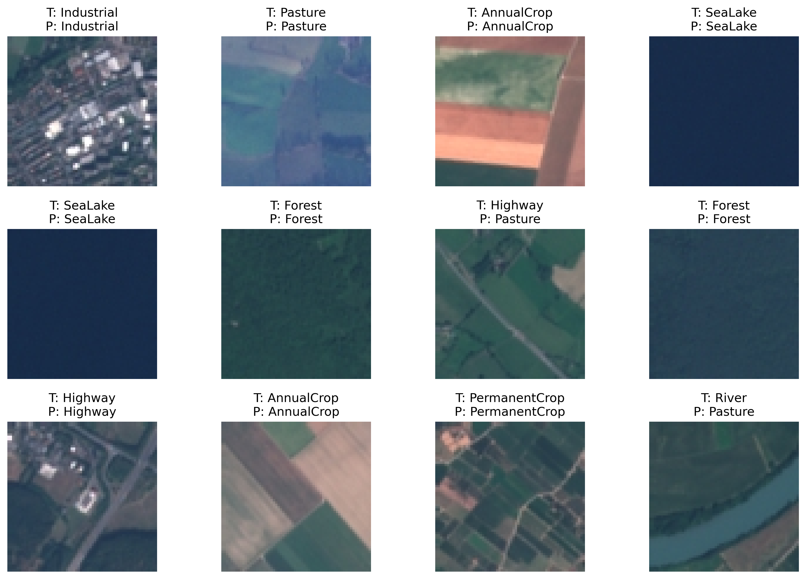
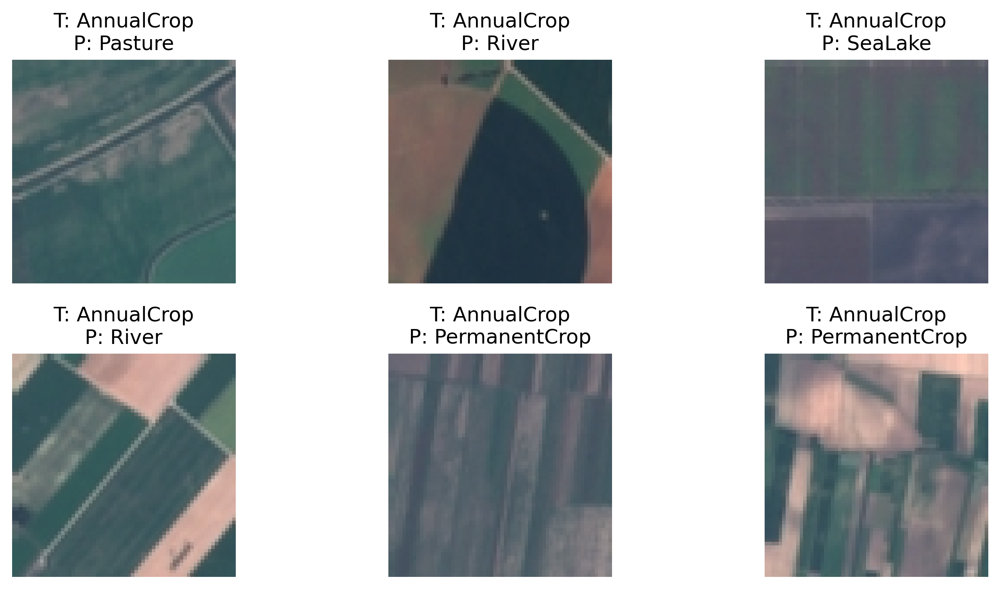
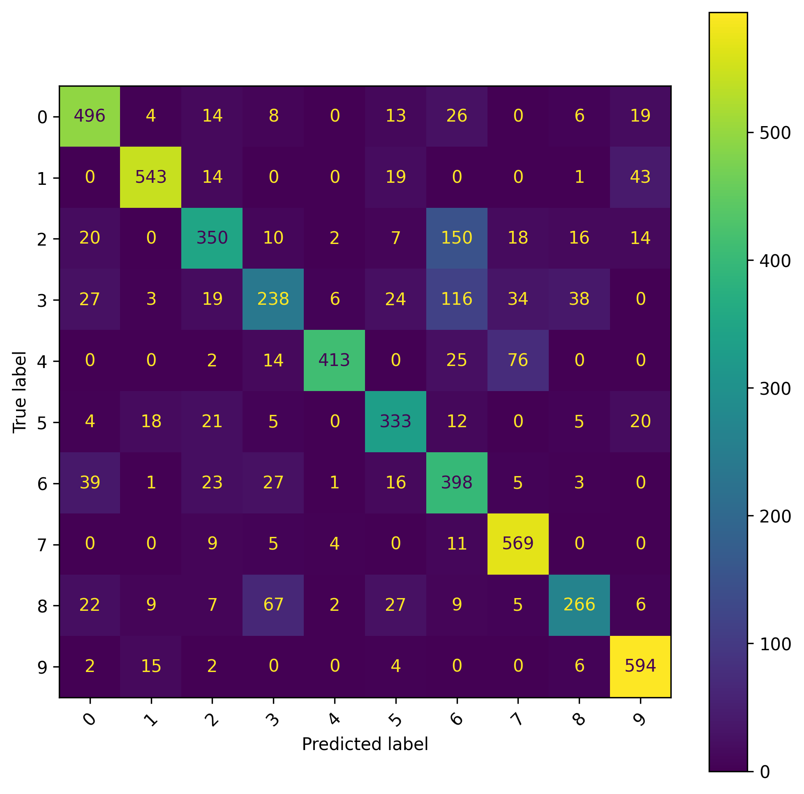

# 🛰️ Satellite Image Classification with PyTorch

## 📌 Overview
This project builds a Convolutional Neural Network (CNN) to classify satellite images into land use and land cover categories using the EuroSAT dataset (Sentinel-2 imagery).

The goal is to demonstrate deep learning applied to geospatial data, with a focus on environmental and remote sensing applications.

---

## 🌍 Dataset
- EuroSAT dataset
- Sentinel-2 satellite images
- 10 land cover classes:
  - Forest, River, Residential, Industrial, Sea/Lake, etc.

---

## 🧠 Methodology
1. Data loading and preprocessing using `torchvision`
2. Train/test split
3. CNN model architecture:
   - 2 convolutional layers
   - Max pooling
   - Fully connected layers
4. Training using cross-entropy loss and Adam optimizer
5. Evaluation on test dataset

---

## 📊 Results

- **Accuracy:** 78%  
- **Macro F1-score:** 0.77  
- **Weighted F1-score:** 0.78  

---

### 📈 Class-wise Performance

| Class                     | Precision | Recall | F1-score |
|--------------------------|----------|--------|----------|
| AnnualCrop               | 0.81     | 0.85   | 0.83     |
| Forest                   | 0.92     | 0.88   | 0.90     |
| HerbaceousVegetation     | 0.76     | 0.60   | 0.67     |
| Highway                  | 0.64     | 0.47   | 0.54     |
| Industrial               | 0.96     | 0.78   | 0.86     |
| Pasture                  | 0.75     | 0.80   | 0.77     |
| PermanentCrop            | 0.53     | 0.78   | 0.63     |
| Residential              | 0.80     | 0.95   | 0.87     |
| River                    | 0.78     | 0.63   | 0.70     |
| SeaLake                  | 0.85     | 0.95   | 0.90     |

---

### 🧠 Performance Insights

The model performs strongly on visually distinct and homogeneous land cover classes such as:

- **Forest (F1: 0.90)**
- **SeaLake (F1: 0.90)**
- **Residential (F1: 0.87)**

Lower performance is observed in more complex or visually similar classes:

- **Highway (F1: 0.54)** → thin, linear structures
- **HerbaceousVegetation (F1: 0.67)** → spectral similarity with other vegetation
- **PermanentCrop (F1: 0.63)** → confusion with agricultural classes

Notably, **PermanentCrop** shows high recall (0.78) but low precision (0.53), indicating the model tends to over-predict this class.

---

### 📊 Visual Results

#### Sample Satellite Images


#### Model Predictions


#### Random Predictions


#### Misclassifications


#### Confusion Matrix


---

### 🎯 Key Takeaways

- CNNs effectively capture large-scale spatial patterns in satellite imagery  
- Performance is strongest for homogeneous land cover types  
- Fine-grained and mixed land-use classes remain challenging  
- Future improvements may include:
  - deeper architectures (e.g., ResNet)
  - higher-resolution imagery
  - segmentation-based approaches (e.g., U-Net)
    
---

## 🛠️ Tech Stack
- Python
- PyTorch
- torchvision
- NumPy
- Matplotlib

---

## 🚀 How to Run

```bash
conda create -n satimg-ml python=3.10
conda activate satimg-ml
pip install -r requirements.txt
