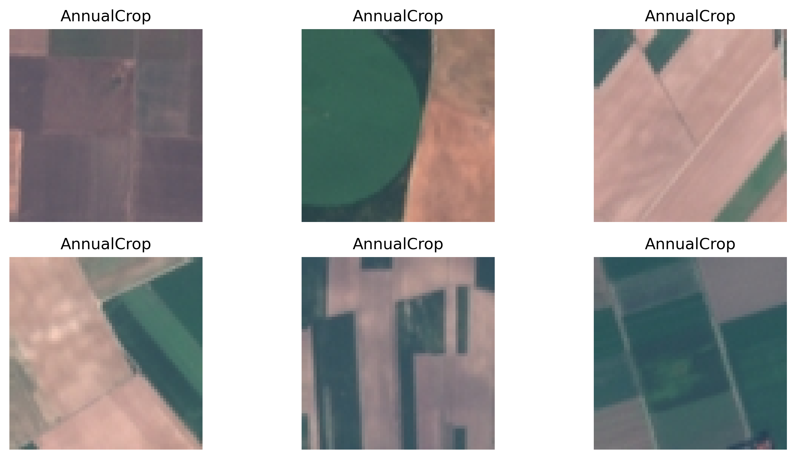
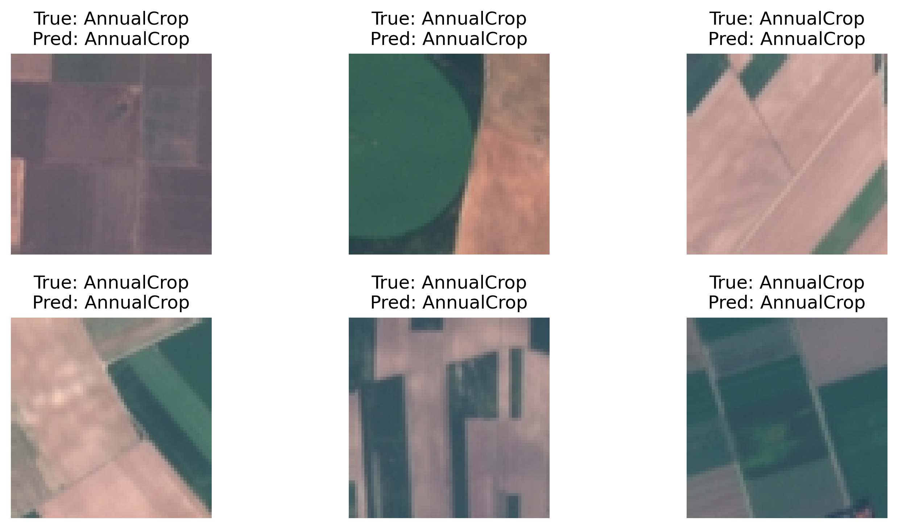

# 🛰️ Satellite Image Classification with PyTorch

## 📌 Overview
This project builds a Convolutional Neural Network (CNN) to classify satellite images into land use and land cover categories using the EuroSAT dataset (Sentinel-2 imagery).

The goal is to demonstrate deep learning applied to geospatial data, with a focus on environmental and remote sensing applications.

---

## 🌍 Dataset
- EuroSAT dataset
- Sentinel-2 satellite images
- 10 land cover classes:
  - Forest, River, Residential, Industrial, Sea/Lake, etc.

---

## 🧠 Methodology
1. Data loading and preprocessing using `torchvision`
2. Train/test split
3. CNN model architecture:
   - 2 convolutional layers
   - Max pooling
   - Fully connected layers
4. Training using cross-entropy loss and Adam optimizer
5. Evaluation on test dataset

---

## 📊 Results

### Sample Satellite Images


### Model Predictions


- Model Accuracy: **XX%**

---

## 🛠️ Tech Stack
- Python
- PyTorch
- torchvision
- NumPy
- Matplotlib

---

## 🚀 How to Run

```bash
conda create -n satimg-ml python=3.10
conda activate satimg-ml
pip install -r requirements.txt
